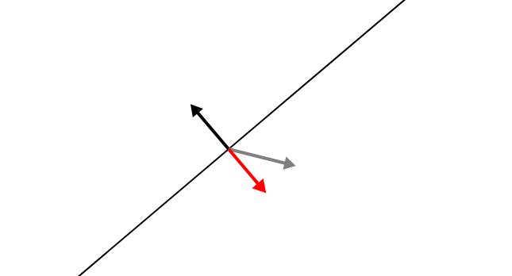

# The Inner Product as a Decision Rule

[Associated blog post](https://jeremykun.com/2017/05/22/the-inner-product-as-a-decision-rule/)

[](http://j2kun.github.io/decision-rule/index.html)

(Click the image above or [this link](http://j2kun.github.io/decision-rule/index.html) for a demo)

# Setup for running on a local machine

Intall prerequisites

```
npm install   # or yarn install
npm install -g gulp
gulp watch    # demo live updates when code changes
```

Then open `index.html` in a web browser and drag around the arrowheads.

```
open index.html
```

## Files

`geometry.js` contains the main geometric primitives that are unrelated to
rendering. The coordinate system for these classes is standard Cartesian
(0,0)-in-the-center coordinates.

`main.js` instantiates the geometry objects, renders them with d3, and sets up
the relevant behaviors.
